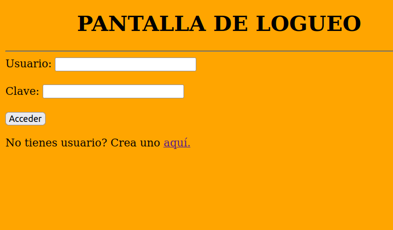
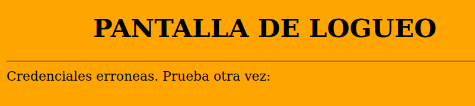
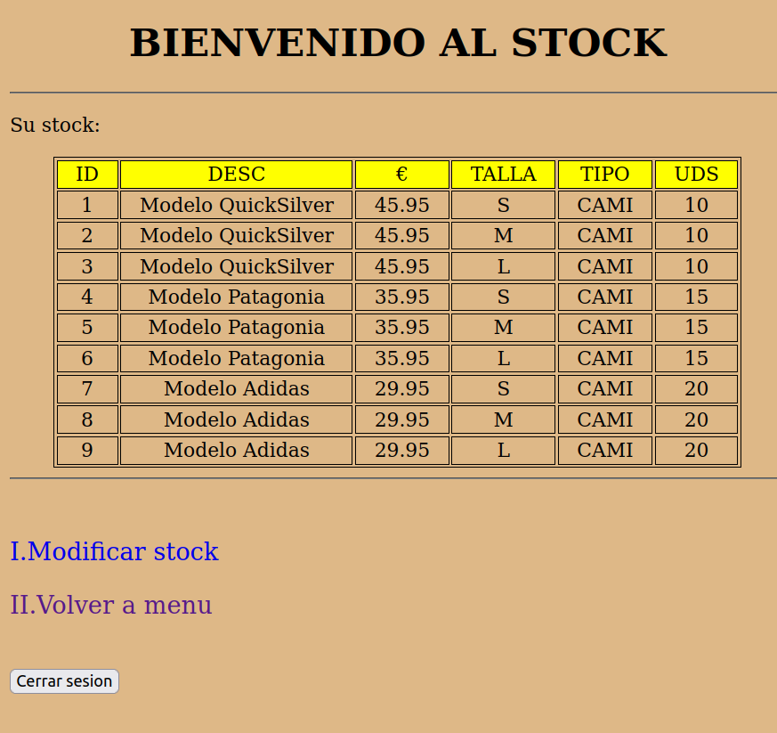
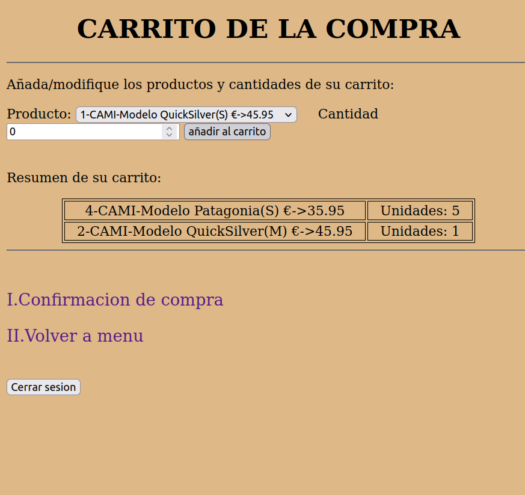
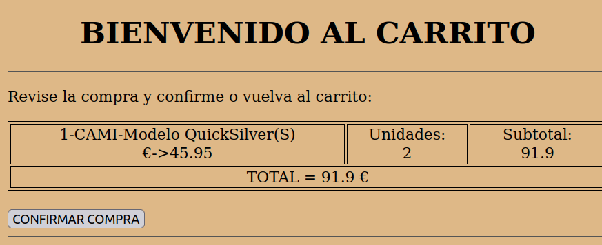
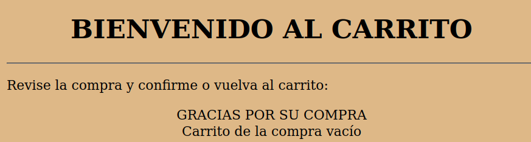

# php_cart_auth

-Simple web app based on an online shop that powered by the following php technologies: authentication with crypt() hashing and mysql.

-To test it you should adapt:
  -Database script 
  -Routes: the forms 'action' and the anchor 'href' attributes
  
-Screenshots:

